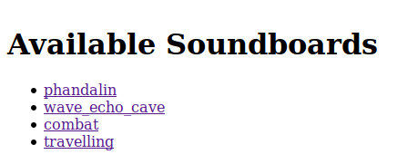
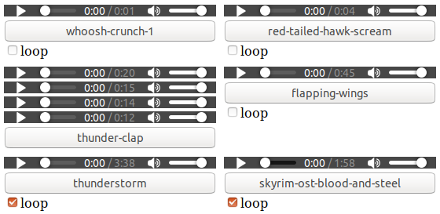

# Simple Soundboard

Simple Soundboard is just that.  It is written as just an HTML page to play looping ambient sounds, looping music, and instantaneous sound effects.  It is just a web page that can be loaded off of the file system (though can be statically hosted if desired).

I wrote it for my Dungeons and Dragons game when I couldn't find a simple and free soundboard.  Your browser is fully capable of mixing sounds and display a user interface.  It's also pervasive to boot so it made sense to just make it a web page.

The example in this repository is statically hosted to play with: <https://vietthe.dev/simple-soundboard/v2.0/soundboard.html>

# Usage

Open up [`soundboard.html`](./soundboard.html) in your favorite browser.  I've tested it mostly with Firefox on Linux (Ubuntu), Firefox on Mac OS X, and Chrome on Mac OS X.

*The project is **not** optimized for use on mobile devices.*



The first screen you see is a list of all the soundboards defined in [`definitions.js`](./definitions.js).  Clicking on a soundboard link takes you to it.  The URL for a specific soundboard is simply the soundboard name in the query string. For example, you can go to the `combat` soundboard by appending `?combat` to the `soundboard.html` URL.  Multiple soundboards can be opened up in separate tabs and/or windows.  This lets you organize your soundboards into orthogonal concerns allowing you to compose them (like "traveling" and "combat").



Each soundboard is a grid of sounds and/or sound groups.  Each sound is placed into its own block.  The block shows the audio widget(s) for the sound(s) which allows you to play/pause, scrub time, and change volume. Beneath the audio widgets are numerous convenience buttons.

- The first button contains the name of the sound or sound group.  It can be used to quick-scrub to the beginning of the sound and play the sound.
- Next to it are the fade-in ("f in") and fade-out ("f out") buttons.
  - The fade-in button will quick-scrub to the beginning of the sound, set the volume to zero, play the sound, and increase the volume to 100% over four seconds.
  - The fade-out button simply transitions the volume to 0% over four seconds and stops the sound when the volume hits 0%.
- The row of buttons underneath are quick controls for changing volume.
  - The "-10%" and "+10%" buttons will decrement and increment volume by 10% points respectively.
  - The "0%", "50%", and "100%" buttons will directly set the volume to the specified level.
- Beneath all of the buttons there may be a loop checkbox.  This controls whether the sound loops or not.  By default sounds that are 50 seconds or longer are marked for looping.  Sound groups cannot be looped and thus do not have a loop checkbox.

## Customizing

Edit [`definitions.js`](./definitions.js) to change your soundboards.  The `soundboards` global variable defined by this file will be used to define your soundboards.  The variable should be a hash object where the key is the name of the soundboard and the value is a list of sounds and/or sound group definitions.

If a sound is specified as a string it is assumed to be the URL of the sound file.  In order to support loading the soundboard from the filesystem the URLs should be written as relative to where `soundboard.html` is on the filesystem.  Sounds that are longer than 60 seconds are automatically marked as looping, but you can simply change the loop checkbox to change whether that sound clip loops.

If the sound is specified as a hash object then two keys are expected: `name` and `audio`.  `name` should just be a string for the text in the play button.  `audio` should be an array of sound URLs associated with this one sound block.  The object definition allows specifying multiple sounds to be played randomly from one button.  Which sound is played is sampled randomly without replacement.  This means each sound will be played once before any sound is repeated.  These grouped sounds cannot be looped.

### Example

```js
var soundboards = {}
soundboards.combat = [
  './relative/url/to/music.ogg',
  {
    'name': 'effect',
    'audio': [
      './relative/url/to/effect-1.ogg',
      './relative/url/to/effect-2.ogg',
      './relative/url/to/effect-3.ogg',
    ],
  },
];
```

# Attribution

The project started off by editing [ryandoherty/ClouserW-Soundboard](https://github.com/ryandoherty/ClouserW-Soundboard).

## Audio

To demonstrate the soundboard there are some example audio clips in the project that need to be attributed.  These audio clips came from YouTube; their respective source URLs are listed below.  The clips were chopped up and converted to OGG using [Audacity](https://www.audacityteam.org/).  Some were manually edited to loop cleanly.

- `./ambient/docks.ogg`: https://www.youtube.com/watch?v=35H1tJ-VUQ8
- `./ambient/dripping-cave.ogg`: https://www.youtube.com/watch?v=3Hwr_BaekgM
- `./ambient/evening-town.ogg`: https://www.youtube.com/watch?v=bSbYpFMNxLI
- `./ambient/forest-daytime.ogg`: https://www.youtube.com/watch?v=6Em9tLXbhfo
- `./ambient/horseback-travelling.ogg`: https://www.youtube.com/watch?v=PIvykxZ0ppQ
- `./ambient/night-camp.ogg`: https://www.youtube.com/watch?v=7KFoj-SOfHs
- `./ambient/rapid-river.ogg`: https://www.youtube.com/watch?v=KRg0vHytUzg
- `./ambient/small-marketplace.ogg`: https://www.youtube.com/watch?v=x2UulCWGess
- `./ambient/thunderstorm.ogg`: https://www.youtube.com/watch?v=eqabnkMmqyM
- `./ambient/town-square-daytime.ogg`: https://www.youtube.com/watch?v=NeOg8iCFfTA
- `./ambient/woodland-village.ogg`: https://www.youtube.com/watch?v=-IEAfnRneP4
- `./effects/arrow-loose-and-hit-*.ogg`: https://www.youtube.com/watch?v=e8VxBmZqFkY
- `./effects/dirt-slam-*.ogg`: https://www.youtube.com/watch?v=WOWav94syLc
- `./effects/dragon-bite-*.ogg`: https://www.youtube.com/watch?v=WOWav94syLc
- `./effects/ooze-*.ogg`: https://www.youtube.com/watch?v=XxbTFBkNfgQ
- `./effects/owlbear-roar-*.ogg`: https://www.youtube.com/watch?v=nqFjsnoDb2g
- `./effects/slam-attack-*.ogg`: https://www.youtube.com/watch?v=WOWav94syLc
- `./effects/swimming-*.ogg`: https://www.youtube.com/watch?v=f4JImUZwTwo
- `./effects/sword-clash-*.ogg`: https://www.youtube.com/watch?v=f3mktVQ-n_c
- `./effects/thunder-clap-1.ogg`: https://www.youtube.com/watch?v=ZHeLUVDYLIg
- `./effects/thunder-clap-2.ogg`: https://www.youtube.com/watch?v=QZpgHrKXooc
- `./effects/thunder-clap-3.ogg`: https://www.youtube.com/watch?v=QZpgHrKXooc
- `./effects/thunder-clap-4.ogg`: https://www.youtube.com/watch?v=QZpgHrKXooc
- `./effects/wave-crash-*.ogg`: https://www.youtube.com/watch?v=xvNNTc6ZPtQ
- `./music/darkest-dungeon-the-cove-battle.ogg`: https://www.youtube.com/watch?v=tluwkXgr93Y
- `./music/skyrim-ost-blood-and-steel.ogg`: https://www.youtube.com/watch?v=q_AUBic3NEo

# Getting Sound Clips

So far I've been finding clips and audio tracks on YouTube, grabbing them using [`youtube-dl`](https://github.com/ytdl-org/youtube-dl), and editing them using [Audacity](https://www.audacityteam.org/).  I've been doing this all on a Ubuntu machine. `youtube-dl` can be grabbed using `pip`.  Audacity can be installed from the Ubuntu package repository (`sudo apt install audacity`).

# Contributing

The interface is purposefully spartan.  Feel free to send me pull requests if you have nice styling or features.

# License

> The MIT License (MIT)
>
> Copyright © 2019 Viet T. Nguyen
>
> Permission is hereby granted, free of charge, to any person obtaining a copy of this software and associated documentation files (the “Software”), to deal in the Software without restriction, including without limitation the rights to use, copy, modify, merge, publish, distribute, sublicense, and/or sell copies of the Software, and to permit persons to whom the Software is furnished to do so, subject to the following conditions:
>
> The above copyright notice and this permission notice shall be included in all copies or substantial portions of the Software.
>
> THE SOFTWARE IS PROVIDED “AS IS”, WITHOUT WARRANTY OF ANY KIND, EXPRESS OR IMPLIED, INCLUDING BUT NOT LIMITED TO THE WARRANTIES OF MERCHANTABILITY, FITNESS FOR A PARTICULAR PURPOSE AND NONINFRINGEMENT. IN NO EVENT SHALL THE AUTHORS OR COPYRIGHT HOLDERS BE LIABLE FOR ANY CLAIM, DAMAGES OR OTHER LIABILITY, WHETHER IN AN ACTION OF CONTRACT, TORT OR OTHERWISE, ARISING FROM, OUT OF OR IN CONNECTION WITH THE SOFTWARE OR THE USE OR OTHER DEALINGS IN THE SOFTWARE.
